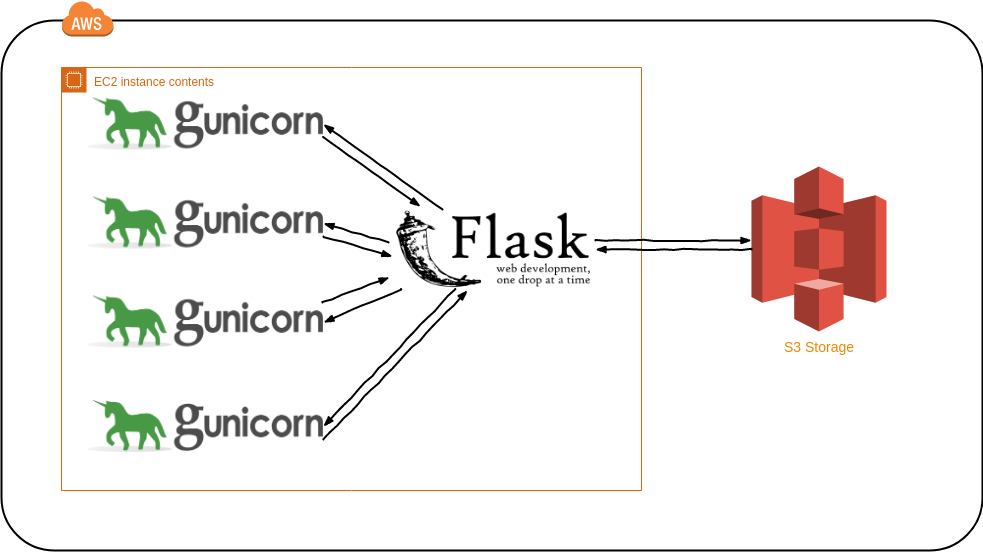

# Style Transfer Website

A website that applies artistic styles to your photo. Based on the Artistic Style Transfer using Neural Networks. This project is an extension of [Style transfer app](https://github.com/puneet29/StyleTransferApp)

## Live at [bit.ly/stylizeapp](bit.ly/stylizeapp)

Hosted using AWS EC2, AWS S3, Gunicorn and Flask.

## Architecture



## Quick Start

### Running locally

1. Clone the repository

    ```bash
    git clone https://github.com/puneet29/stylizeapp.git
    cd stylizeapp
    ```

2. Create new virtual environment
    - On windows:

        ```bash
        py -3 -m venv venv
        ```

    - On Linux:

        ```bash
        python3 -m venv venv ```

3. Activate virtual environment
    - On windows:

        ```bash
        venv\Scripts\activate
        ```

    - On Linux:

        ```bash
        . venv/bin/activate
        ```

4. Install all the dependencies

    ```bash
    pip3 install -r requirements
    ```

5. Change the secret key in __init__.py at #19. Replace ```os.urandom(24)```
   with actual bytes value.

6. Run Web App

    ```bash
    gunicorn -w 4 -t 600 __init__:app
    ```

### Running on server

Follow the same procedure, except 6th step. While running webapp we want the process to be daemonized, so that it runs in the background. For that:

- Run Web App

    ```bash
    gunicorn -b 0.0.0.0:80 -w 4 -t 600 __init__:app -D
    ```

We bind our application to all HTTP IPv4 addresses on the server using
0.0.0.0:80 and run 4 gunicorn processes that serve our application. The timeout
for each gunicorn worker is set to 600 seconds, to account for 10 min delay
during uploading process. -D option daemonizes the process.

Refer to
[this gist](https://gist.github.com/puneet29/083f8eb14f78f2d7db3bba506e0faa34.js)
on how to setup an AWS EC2 instance.

## Libraries used

- Pytorch
- Flask
- Scipy
- Gunicorn
- Boto3
- Beautiful Soup 4
- Requests

## References

- [A Neural Algorithm of Artistic Style](https://arxiv.org/abs/1508.06576)
- [Perceptual Losses for Real-Time Style Transfer and Super-Resolution](https://arxiv.org/abs/1603.08155)
- [Instance Normalization](https://arxiv.org/pdf/1607.08022.pdf)
